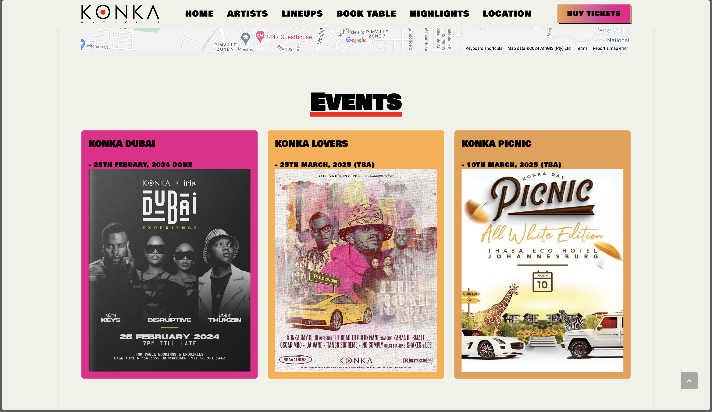

#### Konka Replica

###### Date Started: 03/29/2024

###### Last Updated: 06/20/2024

###### Deployment: Netlify

###### Partner: [Rethabile Mohapi](https://github.com/Rethabileenno)

---

###### Tech Stack: HTML5 CSS Bootstrap OOPJS

---

##### Welcome to Konka Replica ! If you're here, you're checking out how to make your own Ticketstation and you can rest assured that you come to the right place. Feel free to explore, and remember, the code is yours to adapt and use however you like. Enjoy!

---

---

###### Features:

##### - Responsive design that adapts to different screen sizes.

##### - Semantic HTML5 elements for better structure and readability.

##### - External CSS file for styling.

##### - Detailed sections about highlights, checkout, payment..etc

###### Process:

##### - We Started with a basic bootstrap template.

##### - Cleared out any info that was not needed.

##### - Filled out each section with relevant information and structured them properly.

##### - Styled the webpage using an external CSS file.

##### - Added OOP JS to handle the purchase of the tickets

###### Learnings:

##### - Gained a deeper understanding of HTML5 and CSS.

##### - Learned how to use OOP concepts .

##### - Improved skills in responsive web design.
